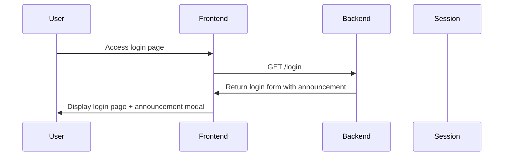
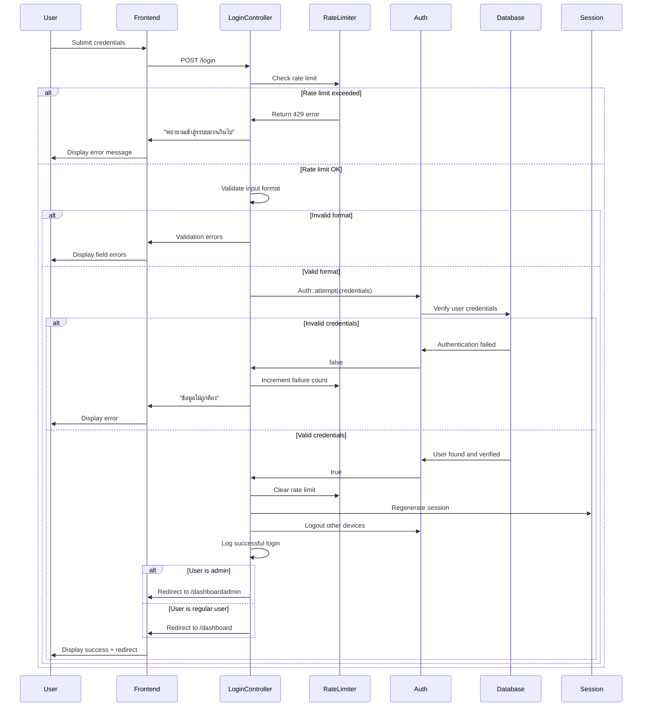
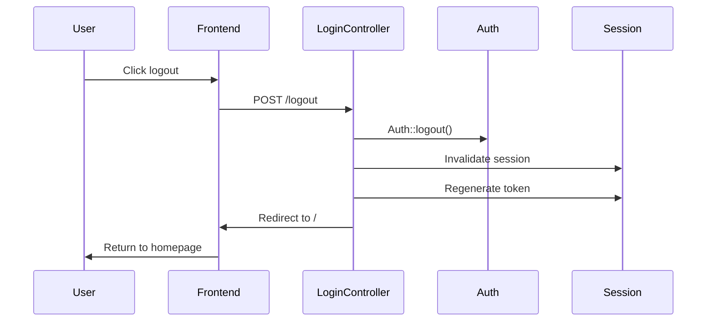

# Authentication Flow Specification - ระบบประเมิน 360 องศา

## Overview / ภาพรวม

This document describes the complete authentication flow for the 360-degree evaluation system. The system uses a custom authentication mechanism based on employee ID and password.

เอกสารนี้อธิบายกระบวนการล็อกอินแบบครบถ้วนของระบบประเมิน 360 องศา ระบบใช้การยืนยันตัวตนด้วยรหัสพนักงานและรหัสผ่าน

## Authentication Method / วิธีการยืนยันตัวตน

### Credentials Format / รูปแบบข้อมูลเข้าสู่ระบบ

- **Employee ID (รหัสพนักงาน)**: 6-digit numeric code
- **Password (รหัสผ่าน)**: 8-digit numeric code  
- **Default Password**: `01012568` (Thai Buddhist year format)

### Validation Rules / กฎการตรวจสอบ

```php
$credentials = $request->validate([
    'emid'     => 'required|digits:6',    // รหัสพนักงาน 6 หลัก
    'password' => 'required|digits:8',    // รหัสผ่าน 8 หลัก
]);
```

## Complete Authentication Flow / กระบวนการล็อกอินแบบครบถ้วน

### 1. Pre-Login Phase / ขั้นตอนก่อนล็อกอิน



**Key Features:**
- Announcement modal display (required reading)
- Help system integration (video tutorial, LINE support)
- Responsive design for mobile and desktop

### 2. Login Attempt Phase / ขั้นตอนการพยายามล็อกอิน



### 3. Post-Login Security / ความปลอดภัยหลังล็อกอิน

#### Session Security / ความปลอดภัยของเซสชัน

```php
// Security measures implemented:
$request->session()->regenerate();           // ป้องกัน session fixation
Auth::logoutOtherDevices($request->password); // ล็อกเอาต์อุปกรณ์อื่น
```

#### Role-Based Redirection / การส่งต่อตาม Role

```php
if (Auth::user()->role === 'admin') {
    return redirect()->route('admindashboard');
}
return redirect()->route('dashboard');
```

## Rate Limiting System / ระบบจำกัดการพยายาม

### Configuration / การตั้งค่า

- **Maximum attempts**: 5 attempts per key
- **Throttle duration**: 60 seconds
- **Throttle key format**: `{emid}|{ip_address}`

### Implementation / การดำเนินการ

```php
protected function checkTooManyAttempts(Request $request)
{
    $key = $this->throttleKey($request);
    if (RateLimiter::tooManyAttempts($key, 5)) {
        abort(429, 'พยายามเข้าสู่ระบบมากเกินไป กรุณารอสักครู่...');
    }
}

protected function throttleKey(Request $request)
{
    return Str::lower($request->input('emid')) . '|' . $request->ip();
}
```

## Logout Process / กระบวนการออกจากระบบ



### Security Implementation / การดำเนินการด้านความปลอดภัย

```php
public function logout(Request $request)
{
    Auth::logout();                          // ล็อกเอาต์ผู้ใช้
    $request->session()->invalidate();      // ลบเซสชันทั้งหมด
    $request->session()->regenerateToken(); // สร้าง CSRF token ใหม่
    return redirect('/');                   // กลับไปหน้าแรก
}
```

## Error Handling / การจัดการข้อผิดพลาด

### Client-Side Validation / การตรวจสอบฝั่งผู้ใช้

```typescript
const { data, setData, post, processing, errors } = useForm<FormData>({
    emid: '',
    password: '',
    remember: false,
});
```

### Server-Side Errors / ข้อผิดพลาดฝั่งเซิร์ฟเวอร์

| Error Type | Message | Action |
|------------|---------|--------|
| Rate Limit | พยายามเข้าสู่ระบบมากเกินไป กรุณารอสักครู่... | Block for 60 seconds |
| Invalid Format | Validation errors for each field | Show field-specific errors |
| Wrong Credentials | ข้อมูลไม่ถูกต้อง | Increment rate limit counter |
| System Error | Generic error message | Log error and show user-friendly message |

## Logging System / ระบบบันทึกการใช้งาน

### Successful Login / การล็อกอินสำเร็จ

```php
Log::info('Login successful', [
    'emid'       => $request->emid,
    'ip'         => $request->ip(),
    'user_agent' => $request->userAgent(),
    'time'       => now(),
]);
```

### Failed Login / การล็อกอินล้มเหลว

```php
Log::warning('Login failed', [
    'emid'       => $request->emid,
    'ip'         => $request->ip(),
    'user_agent' => $request->userAgent(),
    'time'       => now(),
]);
```

## Integration Points / จุดเชื่อมต่อระบบ

### User Model Integration / การเชื่อมต่อกับ User Model

- Custom route key: `emid` instead of `id`
- Role-based permissions system
- Relationship with organizational structure

### Frontend Integration / การเชื่อมต่อฝั่งผู้ใช้

- Inertia.js for seamless page transitions
- React components for UI
- Real-time form validation
- Announcement system integration

## Security Considerations / ข้อพิจารณาด้านความปลอดภัย

1. **Input Validation**: Strict format validation on both client and server
2. **Rate Limiting**: Protection against brute force attacks
3. **Session Security**: Session regeneration and single-device policy
4. **CSRF Protection**: Laravel's built-in CSRF token system
5. **Logging**: Comprehensive audit trail for all authentication events
6. **Error Disclosure**: Generic error messages to prevent information leakage

## Performance Considerations / ข้อพิจารณาด้านประสิทธิภาพ

- Rate limiting using Laravel's efficient RateLimiter
- Session storage optimization
- Minimal database queries during authentication
- Caching of user permissions and roles