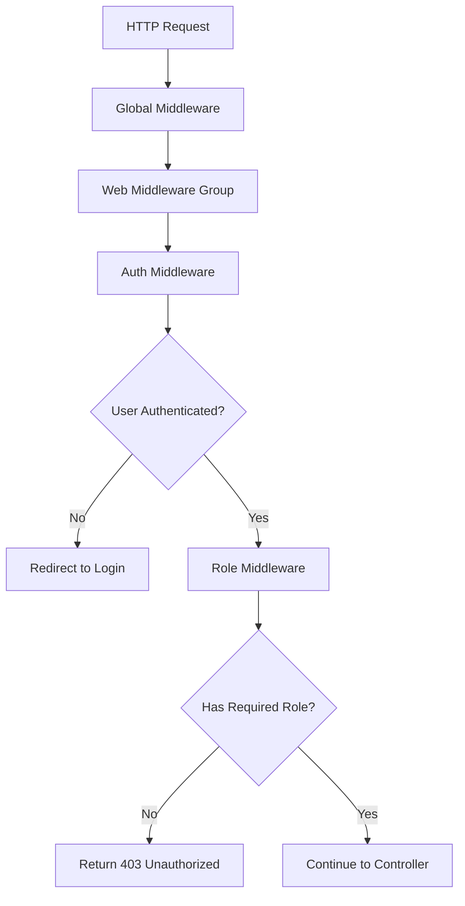

# Middleware and Guards Specification - ระบบประเมิน 360 องศา

## Overview / ภาพรวม

This document details the middleware and authentication guard systems that protect the login process and control access to different parts of the application.

เอกสารนี้รายละเอียดระบบ middleware และ authentication guards ที่ปกป้องกระบวนการล็อกอินและควบคุมการเข้าถึงส่วนต่างๆ ของแอปพลิเคชัน

## Authentication Configuration / การตั้งค่าการยืนยันตัวตน

### File Location / ตำแหน่งไฟล์
- **Configuration**: `config/auth.php`
- **Middleware Directory**: `app/Http/Middleware/`

### Default Guard Configuration / การตั้งค่า Guard เริ่มต้น

```php
// config/auth.php
'defaults' => [
    'guard' => env('AUTH_GUARD', 'web'),
    'passwords' => env('AUTH_PASSWORD_BROKER', 'users'),
],

'guards' => [
    'web' => [
        'driver' => 'session',
        'provider' => 'users',
    ],
],

'providers' => [
    'users' => [
        'driver' => 'eloquent',
        'model' => App\Models\User::class,
    ],
],
```

## Core Middleware / Middleware หลัก

### 1. Guest Middleware / Middleware สำหรับผู้ใช้ที่ยังไม่ได้เข้าสู่ระบบ

#### Purpose / จุดประสงค์
Ensures that only unauthenticated users can access login-related routes.

#### Implementation / การดำเนินการ
```php
// Laravel's built-in RedirectIfAuthenticated middleware
// File: vendor/laravel/framework/src/Illuminate/Auth/Middleware/RedirectIfAuthenticated.php

public function handle($request, Closure $next, ...$guards)
{
    $guards = empty($guards) ? [null] : $guards;

    foreach ($guards as $guard) {
        if (Auth::guard($guard)->check()) {
            return redirect(RouteServiceProvider::HOME);
        }
    }

    return $next($request);
}
```

#### Route Application / การใช้งานกับเส้นทาง
```php
// routes/web.php
Route::middleware('guest')->group(function () {
    Route::get('/', [HomeController::class, 'welcome'])->name('home');
    Route::get('/login', [LoginController::class, 'showLoginForm'])->name('login');
    Route::post('/login', [LoginController::class, 'login']);
});
```

### 2. Auth Middleware / Middleware การยืนยันตัวตน

#### Purpose / จุดประสงค์
Ensures that only authenticated users can access protected routes.

#### Implementation / การดำเนินการ
```php
// Laravel's built-in Authenticate middleware
// File: vendor/laravel/framework/src/Illuminate/Auth/Middleware/Authenticate.php

protected function redirectTo($request)
{
    if (! $request->expectsJson()) {
        return route('login');
    }
}
```

#### Route Application / การใช้งานกับเส้นทาง
```php
// routes/web.php
Route::middleware('auth')->group(function () {
    Route::get('/profile', [ProfileController::class, 'show'])->name('profile.show');
    Route::get('/profile/edit', [ProfileController::class, 'edit'])->name('profile.edit');
    Route::put('/profile', [ProfileController::class, 'update'])->name('profile.update');
});
```

## Custom Middleware / Middleware แบบกำหนดเอง

### 1. RoleMiddleware / Middleware การตรวจสอบบทบาท

#### File Location / ตำแหน่งไฟล์
`app/Http/Middleware/RoleMiddleware.php`

#### Purpose / จุดประสงค์
Controls access based on user roles (admin, user, etc.)

#### Full Implementation / การดำเนินการแบบครบถ้วน

```php
<?php

namespace App\Http\Middleware;

use Closure;
use Illuminate\Http\Request;
use Symfony\Component\HttpFoundation\Response;
use Illuminate\Support\Facades\Auth;
use App\Models\User;
use Inertia\Inertia;

class RoleMiddleware
{
    /**
     * Handle an incoming request.
     *
     * @param  \Closure(\Illuminate\Http\Request): (\Symfony\Component\HttpFoundation\Response)  $next
     */
    public function handle(Request $request, Closure $next, ...$roles): Response
    {
        // Check if user is authenticated
        if (!Auth::check()) {
            return Inertia::render('errors/unauthorized', [
                'message' => 'Authentication required.',
            ])->toResponse($request)->setStatusCode(401);
        }

        // Check if user has required role
        if (!in_array(Auth::user()->role, $roles)) {
            return Inertia::render('errors/unauthorized', [
                'message' => 'Unauthorized access.',
            ])->toResponse($request)->setStatusCode(403);
        }

        return $next($request);
    }
}
```

#### Route Application / การใช้งานกับเส้นทาง

```php
// routes/web.php

// Admin-only routes
Route::middleware(['auth', 'role:admin'])->group(function () {
    Route::get('/dashboardadmin', function () {
        if (Auth::user()->role !== 'admin') {
            abort(403, 'คุณไม่มีสิทธิ์เข้าถึงหน้านี้');
        }
        return app(HomeController::class)->admindashboard();
    })->name('admindashboard');
});

// User-only routes
Route::middleware(['auth', 'role:user'])->group(function () {
    Route::get('/dashboard', [EvaluationAssignmentController::class, 'index'])->name('dashboard');
    Route::get('/evaluations/self', [SelfEvaluationController::class, 'index'])->name('evaluationsself.index');
});
```

#### Error Handling / การจัดการข้อผิดพลาด

| Condition | Response | Status Code |
|-----------|----------|-------------|
| Not authenticated | Render `errors/unauthorized` with auth message | 401 |
| Wrong role | Render `errors/unauthorized` with access message | 403 |
| Valid access | Continue to next middleware/controller | 200 |

### 2. HandleInertiaRequests Middleware / Middleware จัดการคำขอ Inertia

#### File Location / ตำแหน่งไฟล์
`app/Http/Middleware/HandleInertiaRequests.php`

#### Purpose / จุดประสงค์
Shares global data with all Inertia.js pages, including authentication state.

#### Key Features / คุณสมบัติหลัก

```php
public function share(Request $request): array
{
    return array_merge(parent::share($request), [
        // Authentication state
        'auth' => [
            'user' => $request->user() ? [
                'id' => $request->user()->id,
                'name' => $request->user()->fname . ' ' . $request->user()->lname,
                'fname' => $request->user()->fname,
                'lname' => $request->user()->lname,
                'email' => $request->user()->email,
                'role' => $request->user()->role,
                'grade' => $request->user()->grade,
                'user_type' => $request->user()->user_type,
                'photo' => $request->user()->photo,
            ] : null,
        ],

        // Enhanced Flash Messages
        'flash' => function () use ($request) {
            return [
                'success' => $request->session()->get('success'),
                'error' => $request->session()->get('error'), 
                'warning' => $request->session()->get('warning'),
                'info' => $request->session()->get('info'),
                'details' => $request->session()->get('details'),
            ];
        },

        // Enhanced Error Handling
        'errors' => function () use ($request) {
            $errors = $request->session()->get('errors');
            if (!$errors) {
                return (object) [];
            }

            $errorBag = $errors->getBag('default');
            $formattedErrors = [];

            foreach ($errorBag->getMessages() as $field => $messages) {
                $formattedErrors[$field] = $messages;
            }

            return (object) $formattedErrors;
        },

        // Role-based Permissions
        'permissions' => function () use ($request) {
            if (!$request->user()) {
                return [];
            }

            return [
                'can_manage_users' => $request->user()->role === 'admin',
                'can_manage_evaluations' => $request->user()->role === 'admin',
                'can_view_reports' => in_array($request->user()->role, ['admin', 'supervisor']),
                'can_assign_evaluations' => $request->user()->role === 'admin',
            ];
        },
    ]);
}
```

## Middleware Stack Configuration / การตั้งค่า Middleware Stack

### Global Middleware / Middleware ทั่วไป

```php
// bootstrap/app.php or app/Http/Kernel.php
protected $middleware = [
    \App\Http\Middleware\TrustProxies::class,
    \Fruitcake\Cors\HandleCors::class,
    \App\Http\Middleware\PreventRequestsDuringMaintenance::class,
    \Illuminate\Foundation\Http\Middleware\ValidatePostSize::class,
    \App\Http\Middleware\TrimStrings::class,
    \Illuminate\Foundation\Http\Middleware\ConvertEmptyStringsToNull::class,
];
```

### Route Middleware Groups / กลุ่ม Middleware สำหรับเส้นทาง

```php
protected $middlewareGroups = [
    'web' => [
        \App\Http\Middleware\EncryptCookies::class,
        \Illuminate\Cookie\Middleware\AddQueuedCookiesToResponse::class,
        \Illuminate\Session\Middleware\StartSession::class,
        \Illuminate\View\Middleware\ShareErrorsFromSession::class,
        \App\Http\Middleware\VerifyCsrfToken::class,
        \Illuminate\Routing\Middleware\SubstituteBindings::class,
        \App\Http\Middleware\HandleInertiaRequests::class,
    ],

    'api' => [
        'throttle:api',
        \Illuminate\Routing\Middleware\SubstituteBindings::class,
    ],
];
```

### Route-specific Middleware / Middleware เฉพาะเส้นทาง

```php
protected $routeMiddleware = [
    'auth' => \App\Http\Middleware\Authenticate::class,
    'auth.basic' => \Illuminate\Auth\Middleware\AuthenticateWithBasicAuth::class,
    'guest' => \App\Http\Middleware\RedirectIfAuthenticated::class,
    'role' => \App\Http\Middleware\RoleMiddleware::class,
    'password.confirm' => \Illuminate\Auth\Middleware\RequirePassword::class,
    'signed' => \Illuminate\Routing\Middleware\ValidateSignature::class,
    'throttle' => \Illuminate\Routing\Middleware\ThrottleRequests::class,
    'verified' => \Illuminate\Auth\Middleware\EnsureEmailIsVerified::class,
];
```

## Authentication Guards / Guards การยืนยันตัวตน

### 1. Web Guard / Guard เว็บ

#### Configuration / การตั้งค่า

```php
'web' => [
    'driver' => 'session',
    'provider' => 'users',
]
```

#### Features / คุณสมบัติ
- **Session-based authentication** / การยืนยันตัวตนแบบเซสชัน
- **Remember me functionality** / ความสามารถจดจำการเข้าสู่ระบบ
- **Automatic logout on browser close** / ออกจากระบบอัตโนมัติเมื่อปิดเบราว์เซอร์
- **CSRF protection** / การป้องกัน CSRF

#### Usage in Controllers / การใช้งานใน Controllers

```php
// Check if user is authenticated
if (Auth::check()) {
    $user = Auth::user();
}

// Get authenticated user
$user = Auth::user();

// Attempt login
if (Auth::attempt($credentials, $remember)) {
    // Success
}

// Logout
Auth::logout();

// Logout from other devices
Auth::logoutOtherDevices($password);
```

### 2. User Provider / ผู้ให้บริการผู้ใช้

#### Configuration / การตั้งค่า

```php
'providers' => [
    'users' => [
        'driver' => 'eloquent',
        'model' => App\Models\User::class,
    ],
]
```

#### Custom User Model Integration / การเชื่อมต่อ User Model แบบกำหนดเอง

```php
// app/Models/User.php
class User extends Authenticatable implements MustVerifyEmail
{
    // Custom route key for URL binding
    public function getRouteKeyName(): string
    {
        return 'emid';  // Use employee ID instead of primary key
    }

    // Role-based helper methods
    public function canEvaluateUser($userId, $angle)
    {
        // Custom authorization logic
    }

    public function getRequiredEvaluationAngles()
    {
        $grade = (int) $this->grade;
        return $grade >= 9 ? ['บน', 'ล่าง', 'ซ้าย', 'ขวา'] : ['บน', 'ซ้าย'];
    }
}
```

## Authorization Policies / นโยบายการอนุญาต

### 1. Role-Based Authorization / การอนุญาตแบบบทบาท

```php
// In blade templates or controllers
@can('manage-users')
    <!-- Admin content -->
@endcan

// In controllers
if ($user->can('manage-evaluations')) {
    // Allow access
}
```

### 2. Custom Policy Example / ตัวอย่างนโยบายกำหนดเอง

```php
// app/Policies/EvaluationAssignmentPolicy.php
class EvaluationAssignmentPolicy
{
    public function view(User $user, EvaluationAssignment $assignment)
    {
        return $user->id === $assignment->evaluator_id || 
               $user->id === $assignment->evaluatee_id ||
               $user->role === 'admin';
    }

    public function create(User $user)
    {
        return $user->role === 'admin';
    }

    public function update(User $user, EvaluationAssignment $assignment)
    {
        return $user->role === 'admin';
    }
}
```

## Security Features / คุณสมบัติความปลอดภัย

### 1. Session Security / ความปลอดภัยเซสชัน

```php
// Automatic session regeneration on login
$request->session()->regenerate();

// Force logout from other devices
Auth::logoutOtherDevices($password);

// Session invalidation on logout
$request->session()->invalidate();
$request->session()->regenerateToken();
```

### 2. CSRF Protection / การป้องกัน CSRF

```php
// Automatic CSRF token verification
// app/Http/Middleware/VerifyCsrfToken.php
protected $except = [
    // API routes that don't need CSRF protection
];
```

### 3. Rate Limiting Integration / การเชื่อมต่อการจำกัดอัตรา

```php
// Built into LoginController
protected function checkTooManyAttempts(Request $request)
{
    $key = $this->throttleKey($request);
    if (RateLimiter::tooManyAttempts($key, 5)) {
        abort(429, 'พยายามเข้าสู่ระบบมากเกินไป กรุณารอสักครู่...');
    }
}
```

## Middleware Execution Flow / ขั้นตอนการทำงานของ Middleware

### 1. Login Page Request Flow / ขั้นตอนคำขอหน้าล็อกอิน

```mermaid
graph TD
    A[HTTP Request] --> B[Global Middleware]
    B --> C[Web Middleware Group]
    C --> D[Guest Middleware]
    D --> E{User Authenticated?}
    E -->|Yes| F[Redirect to Dashboard]
    E -->|No| G[LoginController@showLoginForm]
    G --> H[Return Login Page]
```

### 2. Protected Route Access Flow / ขั้นตอนการเข้าถึงเส้นทางที่ปกป้อง



### 3. Logout Process Flow / ขั้นตอนการออกจากระบบ

```mermaid
graph TD
    A[POST /logout] --> B[Web Middleware Group]
    B --> C[CSRF Verification]
    C --> D[Auth::logout()]
    D --> E[Session Invalidation]
    E --> F[Token Regeneration]
    F --> G[Redirect to Home]
```

## Error Handling / การจัดการข้อผิดพลาด

### 1. Authentication Failures / ความล้มเหลวในการยืนยันตัวตน

```php
// Redirect unauthenticated users to login
protected function redirectTo($request)
{
    if (! $request->expectsJson()) {
        return route('login');
    }
    
    // For API requests, return 401
    return null;
}
```

### 2. Authorization Failures / ความล้มเหลวในการอนุญาต

```php
// RoleMiddleware returns appropriate error page
return Inertia::render('errors/unauthorized', [
    'message' => 'Unauthorized access.',
])->toResponse($request)->setStatusCode(403);
```

### 3. Session Timeout Handling / การจัดการหมดเวลาเซสชัน

```php
// Automatic redirect to login on session expiration
// Handled by Laravel's session middleware
```

## Performance Considerations / ข้อพิจารณาด้านประสิทธิภาพ

### 1. Database Query Optimization / การปรับปรุงการสืบค้นฐานข้อมูล

```php
// User provider uses optimized queries
// Index on emid field for fast lookups
// Minimal user data loaded for authentication
```

### 2. Session Storage / การเก็บข้อมูลเซสชัน

```php
// Configuration for optimal session performance
'driver' => env('SESSION_DRIVER', 'file'),
'lifetime' => 120,
'expire_on_close' => false,
'encrypt' => false,
'files' => storage_path('framework/sessions'),
'connection' => null,
'table' => 'sessions',
```

### 3. Middleware Caching / การแคช Middleware

```php
// Middleware results can be cached for better performance
// User permissions cached in session
// Role checks optimized for frequent access
```

## Testing Middleware / การทดสอบ Middleware

### 1. Unit Tests / การทดสอบหน่วย

```php
public function test_guest_middleware_redirects_authenticated_users()
{
    $user = User::factory()->create();
    
    $response = $this->actingAs($user)->get('/login');
    
    $response->assertRedirect('/dashboard');
}

public function test_auth_middleware_redirects_guests()
{
    $response = $this->get('/dashboard');
    
    $response->assertRedirect('/login');
}
```

### 2. Role Middleware Tests / การทดสอบ Role Middleware

```php
public function test_admin_can_access_admin_routes()
{
    $admin = User::factory()->create(['role' => 'admin']);
    
    $response = $this->actingAs($admin)->get('/dashboardadmin');
    
    $response->assertOk();
}

public function test_user_cannot_access_admin_routes()
{
    $user = User::factory()->create(['role' => 'user']);
    
    $response = $this->actingAs($user)->get('/dashboardadmin');
    
    $response->assertStatus(403);
}
```

## Best Practices / แนวปฏิบัติที่ดี

### 1. Middleware Organization / การจัดระเบียบ Middleware

- Keep middleware focused on single responsibility
- Use meaningful names for custom middleware
- Document middleware purpose and usage
- Test middleware thoroughly

### 2. Security Practices / แนวปฏิบัติด้านความปลอดภัย

- Always validate user permissions in middleware
- Use HTTPS for all authentication-related requests
- Implement proper session management
- Log security-related events

### 3. Performance Optimization / การปรับปรุงประสิทธิภาพ

- Cache user permissions when possible
- Minimize database queries in middleware
- Use efficient session storage
- Monitor middleware performance